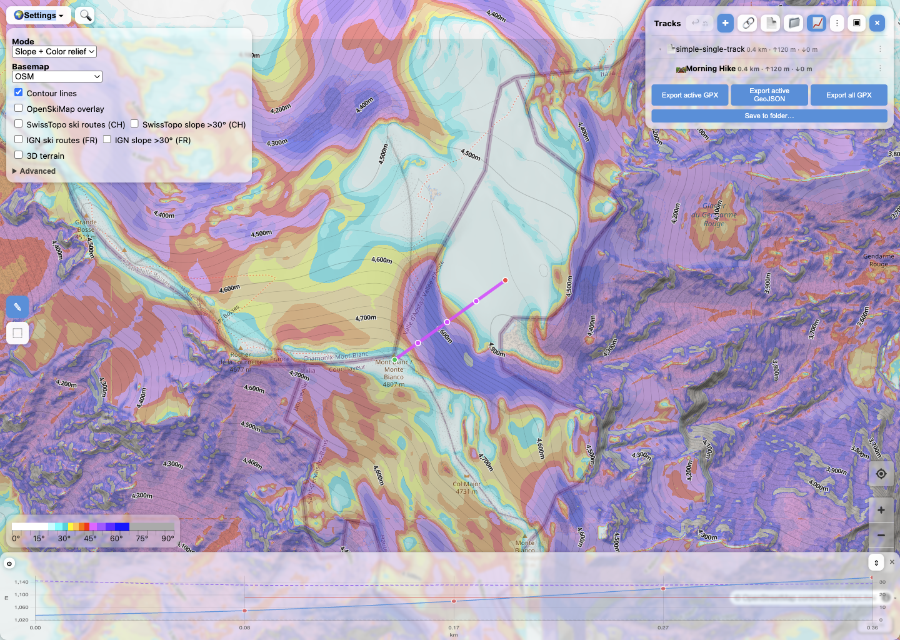

# Slope Mapper

Slope Mapper is a static browser app for exploring terrain with slope-focused map layers and editing, inspecting, and exporting GPX tracks.

- Docs: [https://eslopemap.github.io/app/user-guide/](https://eslopemap.github.io/app/user-guide/)
- In-repo docs entry: [`app/user-guide/`](app/user-guide/)
- App entry: [`app/index.html`](app/index.html)
- Contributing guide: [`CONTRIBUTING.md`](CONTRIBUTING.md)
- Screenshot file: [`app/user-guide/assets/edit-mode.png`](app/user-guide/assets/edit-mode.png)



## What it includes

- Terrain visualization with slope, aspect, color relief, hillshade, contours, and optional 3D terrain
- A browser-based GPX track editor
- Elevation/profile charts
- A static docs site shipped with the app
- Vendored browser dependencies under `app/vendor/`

## Documentation

User documentation is published here:

- [https://eslopemap.github.io/app/user-guide/](https://eslopemap.github.io/app/user-guide/)

The same docs live in this repository under:

- [`app/user-guide/`](app/user-guide/)

## Quick start

The app has no build step for local development.

### Run locally

Serve the repository root as static files:

```bash
python3 -m http.server 8089
```

Then open:

- App: `http://localhost:8089/app/index.html`
- Docs: `http://localhost:8089/app/user-guide/`

### Install test dependencies

```bash
npm install
```

If needed:

```bash
npx playwright install chromium
```

### Run tests

Prefer unit tests first:

```bash
npm run test:unit
```

Run browser tests:

```bash
npm test
```

## Project shape

- `app/` — shipped application and docs
- `app/js/` — application modules
- `app/user-guide/` — static user documentation
- `app/vendor/` — vendored third-party browser assets and generated import maps
- `tests/unit/` — unit tests
- `tests/e2e/` — Playwright tests
- [`tests/README.md`](tests/README.md) — test inventory and coverage setup guide
- `deps.json` — vendoring manifest
- `scripts/vendor-deps.mjs` — vendoring/update/check script

## Dependency strategy

This project prefers a zero-build, static architecture:

- app code is plain browser JavaScript modules
- third-party dependencies are vendored locally instead of being loaded from runtime CDNs
- ESM dependencies are exposed via generated import maps where that is the lowest-risk approach
- classic script assets are still used where that remains the safer browser delivery format

A notable detail is that the map runtime currently uses the `@eslopemap/maplibre-gl` fork, pinned in `deps.json`, rather than upstream `maplibre-gl`.

## Contributing

- See [`CONTRIBUTING.md`](CONTRIBUTING.md) for local setup, tests, and vendoring guidance.
- See [`FEATURES.md`](FEATURES.md) for functionality and implementation details.
- See [`UI.md`](UI.md) for UI structure and components.
