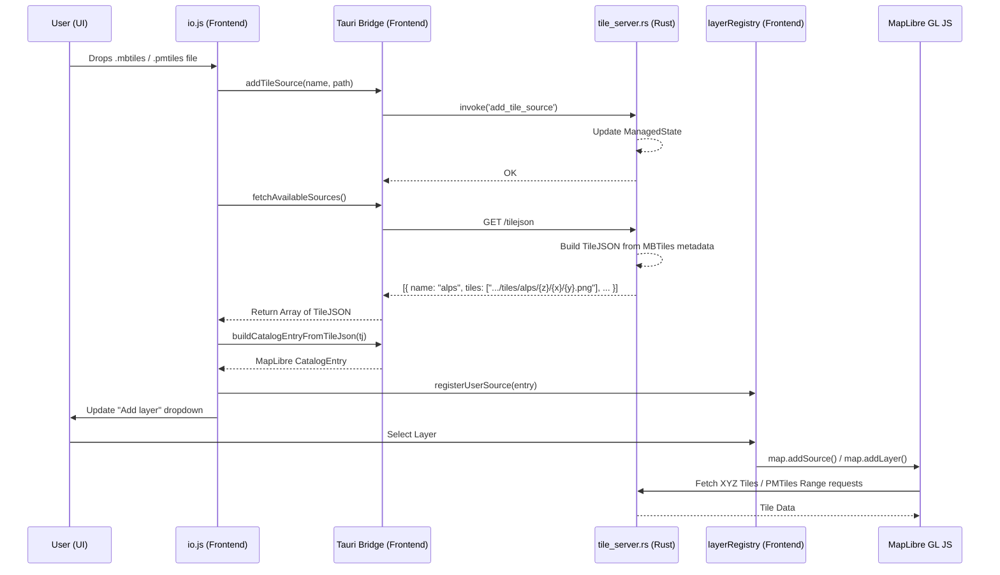

# Local Tile Serving Architecture

This report explains how adding and serving local tiles (`.mbtiles`, `.pmtiles`) works in the application, mapping the flow from the UI down to the Rust backend and back. It also covers the interaction between the legacy `addSource`/`addLayer` approach and the new TileJSON-based serving model, highlighting areas for cleanup.

## 1. How Adding and Serving Local Tiles Works

When a user adds a local tile source (via drag-and-drop or scanning a folder), the application follows a circular flow:

1. **User Action (Frontend):** The user drops a file or selects a folder (`app/js/io.js`).
2. **Registration (Backend):** The frontend invokes a Tauri command (`add_tile_source` or `scan_tile_folder`) which registers the absolute file path and its format (`mbtiles`/`pmtiles`) into the Rust backend's `ManagedState::tile_sources`.
3. **Descriptor Generation (Backend):** The Rust backend runs a local HTTP tile server (`src-tauri/src/tile_server.rs`). This server exposes a `/tilejson` endpoint that lists standard TileJSON descriptors for the registered sources (currently only for `mbtiles`).
4. **Discovery (Frontend):** The frontend fetches `http://127.0.0.1:14321/tilejson` via `fetchAvailableSources()` to discover what the backend is serving.
5. **Catalog Construction (Frontend):** The frontend takes the discovered TileJSON object and converts it into a MapLibre-compatible `CatalogEntry` via `buildCatalogEntryFromTileJson()`. It registers this entry into the `layerRegistry` and updates the UI layer dropdown.
6. **Rendering (Frontend -> Backend):** When the user activates the layer, MapLibre requests the tiles. For `mbtiles`, it fetches XYZ PNG tiles from the Rust backend's `/tiles/...` endpoint. For `pmtiles`, the PMTiles JS protocol handles HTTP Range requests against the backend's `/pmtiles/...` endpoint.

### Architecture Diagram

## 2. Old vs. New Serving Interaction

The codebase currently has **two overlapping mechanisms** for building the MapLibre `CatalogEntry` from a local file:

1. **The Old Method (`buildCatalogEntryFromTileSource` in `layer-registry.js`)**:
   - This method bypasses the `/tilejson` endpoint. It takes the filename and format (`kind: mbtiles | pmtiles`) directly and hardcodes the MapLibre `sourceDef` configuration.
   - For `mbtiles`, it hardcodes `tiles: ['/tiles/name/{z}/{x}/{y}.png']`.
   - For `pmtiles`, it constructs the custom protocol URL: `url: 'pmtiles://.../pmtiles/name'`.
   - **Usage:** Relied upon heavily by the E2E tests (`tests/e2e/tile-serving.spec.js`) and unit tests (`tests/unit/layer-engine.test.mjs`).

2. **The New Method (`buildCatalogEntryFromTileJson` in `tauri-bridge.js`)**:
   - This is the standard, protocol-agnostic approach used in production (`io.js`).
   - It expects a fully formed TileJSON object from the backend's `/tilejson` endpoint.
   - It directly uses the `tiles` array, `minzoom`, `maxzoom`, and `bounds` provided by the server.

### The Feature Gap & Duplication

Because the two methods overlap, there is duplication in how catalog entries are constructed. However, they cannot be unified immediately due to a **feature gap regarding PMTiles**:

- The Rust backend currently **only generates TileJSON for MBTiles** (`tile_server.rs:320` -> `if entry.kind == TileSourceKind::Mbtiles`). It completely skips PMTiles.
- As a result, when a user drops a `.pmtiles` file in production, `fetchAvailableSources()` does not return a TileJSON descriptor for it. `io.js` warns `[tile-drop] TileJSON not found` and aborts registration.
- The E2E tests manually bypass this issue by using the old `buildCatalogEntryFromTileSource` method, which correctly understands the `pmtiles://` format.

## 3. Proposed Cleanup

To clean up the duplication and fix the PMTiles UI bug, we should transition entirely to the TileJSON-based flow:

1. **Update the Rust Backend to Support PMTiles in `/tilejson`:**
   - Emit a pseudo-TileJSON descriptor for `.pmtiles` files. Since standard TileJSON requires a `tiles` array, but MapLibre's PMTiles integration uses the `url` property with the `pmtiles://` protocol, the backend could emit a custom property (e.g., `"protocol": "pmtiles", "url": "pmtiles://..."`) or format the TileJSON so the frontend knows how to handle it.

2. **Update `buildCatalogEntryFromTileJson()`:**
   - Modify the frontend TileJSON parser in `tauri-bridge.js` to recognize the PMTiles indicator.
   - If it detects a PMTiles format, it should construct `{ type: 'raster', url: 'pmtiles://...' }` instead of using the `tiles` array.

3. **Remove the Legacy Method:**
   - Once `buildCatalogEntryFromTileJson()` supports PMTiles, completely delete `buildCatalogEntryFromTileSource()` from `layer-registry.js`.
   - Update `tests/e2e/tile-serving.spec.js` and `tests/unit/layer-engine.test.mjs` to construct mock TileJSON objects and use `buildCatalogEntryFromTileJson()` to verify catalog entry creation.

By consolidating on the TileJSON-based flow, the backend becomes the single source of truth for both metadata (`minzoom`, `bounds`) and URL routing, simplifying the frontend logic.
