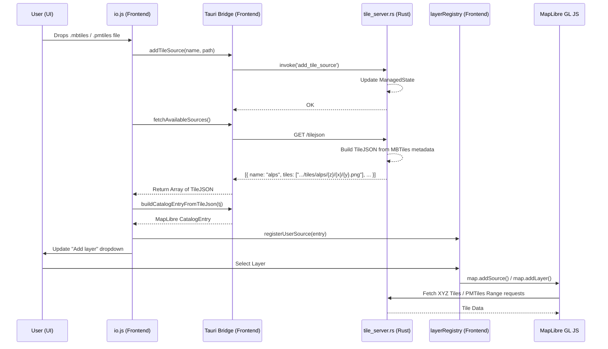

# Local Tile Serving Architecture

This report explains how adding and serving local tiles (`.mbtiles`, `.pmtiles`) works in the application, mapping the flow from the UI down to the Rust backend and back. 

## 1. How Adding and Serving Local Tiles Works

When a user adds a local tile source (via drag-and-drop or scanning a folder), the application follows a circular flow:

1. **User Action (Frontend):** The user drops a file or selects a folder (`app/js/io.js`).
2. **Registration (Backend):** The frontend invokes a Tauri command (`add_tile_source` or `scan_tile_folder`) which registers the absolute file path and its format (`mbtiles`/`pmtiles`) into the Rust backend's `ManagedState::tile_sources`.
3. **Descriptor Generation (Backend):** The Rust backend runs a local HTTP tile server (`src-tauri/src/tile_server.rs`). This server exposes a `/tilejson` endpoint that lists standard TileJSON descriptors for the registered sources (currently for both `mbtiles` and `pmtiles`).
4. **Discovery (Frontend):** The frontend fetches `http://127.0.0.1:14321/tilejson` via `fetchAvailableSources()` to discover what the backend is serving.
5. **Catalog Construction (Frontend):** The frontend takes the discovered TileJSON object and converts it into a MapLibre-compatible `CatalogEntry` via `buildCatalogEntryFromTileJson()`. It registers this entry into the `layerRegistry` and updates the UI layer dropdown.
6. **Rendering (Frontend -> Backend):** When the user activates the layer, MapLibre requests the tiles. For `mbtiles`, it fetches XYZ PNG tiles from the Rust backend's `/tiles/...` endpoint. For `pmtiles`, the PMTiles JS protocol handles HTTP Range requests against the backend's `/pmtiles/...` endpoint.

### Architecture Diagram

